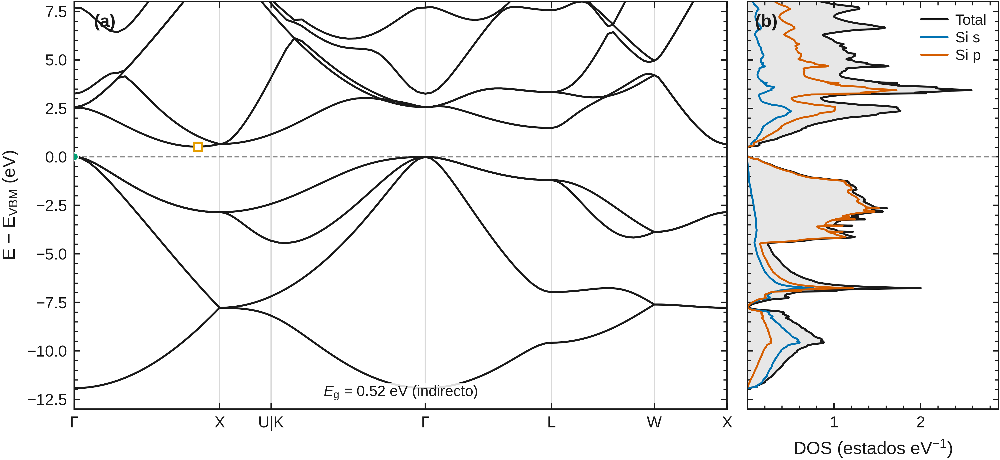
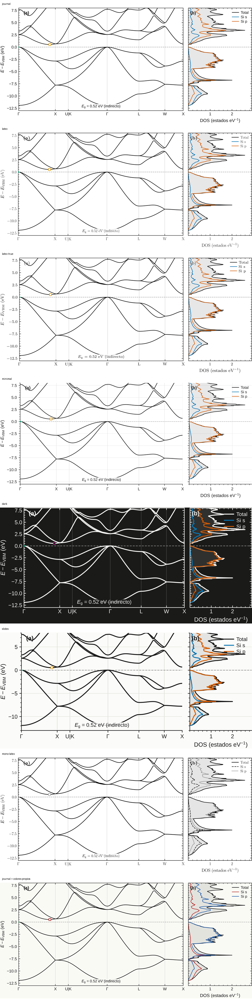
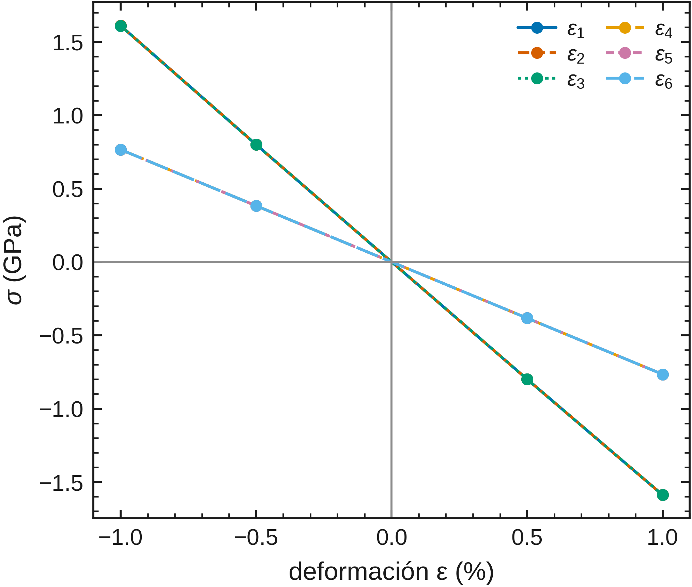

<h1 align="center">Olla-DFT</h1>

<p align="center">
<b>Toolkit de línea de comandos para Quantum ESPRESSO: de un CIF a bandas,
fonones, constantes elásticas, ópticas y mucho más con calidad de
publicación, y con la física que hay detrás de cada número, escrita.</b>
</p>

<p align="center">
<a href="https://github.com/jorgegonzalezsevilla/olla-dft-esp/actions/workflows/ci.yml"></a>
<a href="LICENSE"></a>
<a href="https://doi.org/10.5281/zenodo.22263121"></a>


</p>

<p align="center">
<a href="https://github.com/jorgegonzalezsevilla/olla-dft">English version</a> ·
<a href="#instalación">Instalación</a> ·
<a href="#recorrido-de-cinco-minutos">Recorrido de cinco minutos</a> ·
<a href="docs/TEORIA.md">Teoría</a> ·
<a href="docs/COMANDOS.md">Comandos</a> ·
<a href="examples/">Ejemplos</a>
</p>

<p align="center">

<br>
<sub>Bandas y DOS del silicio a partir de una corrida real de Quantum ESPRESSO, con un solo comando: <code>olla-dft plot .</code></sub>
</p>

Olla-DFT hace para [Quantum ESPRESSO](https://www.quantum-espresso.org) lo
que VASPKIT hace para VASP: lee tu estructura (CIF, POSCAR o un input de
`pw.x`), detecta la simetría, encuentra tus pseudopotenciales, propone cutoffs
y mallas de puntos k, construye el camino de alta simetría y escribe todos los
archivos de entrada listos para correr. Después del cálculo cierra el ciclo:
band gap, bandas, DOS/PDOS, ecuación de estado, constantes elásticas, fonones,
ópticas, función trabajo, cargas, defectos, superficies, transporte, funciones
de Wannier y una larga lista de propiedades derivadas, cada una exportada en
una tabla con su procedencia y dibujada como figura de revista.

## Sobre este proyecto

Olla-DFT es un **proyecto personal de una sola persona, hecho como
pasatiempo**. Lo escribe, lo prueba y lo mantiene Jorge Enrique González
Sevilla en sus ratos libres, a partir de una necesidad propia: una sola
herramienta que lleve un flujo de trabajo de Quantum ESPRESSO desde el archivo
de estructura hasta la figura sin una pila de scripts sueltos, y que explique
la física que aplica en lugar de esconderla. No está afiliado a ninguna
universidad, instituto de investigación ni empresa, no recibe financiamiento
de nadie y no es parte oficial de Quantum ESPRESSO.

Como es el trabajo de una persona en su tiempo libre, se siguen algunas cosas:

- **Las versiones salen cuando salen.** No hay hoja de ruta con fechas.
- **El código no está abierto a commits externos.** No se aceptan pull
  requests; el autor es y seguirá siendo el único que le mete mano al código.
  Lo que sí es muy bienvenido es tu retroalimentación: fallos, números
  equivocados e ideas de funciones, como
  [issues](https://github.com/jorgegonzalezsevilla/olla-dft-esp/issues).
- **Todo es software libre.** GPL-3.0, sin telemetría, nunca se envía nada a
  ningún sitio. Clónalo, léelo, córrelo, bifúrcalo bajo la licencia.

El nombre conserva el guiño al café de Quantum ESPRESSO y le da una identidad
propia: la olla del café de olla. Se hace con cariño desde Guadalajara,
Jalisco, México.

## Contenido

- [Sobre este proyecto](#sobre-este-proyecto)
- [Instalación](#instalación)
- [Recorrido de cinco minutos](#recorrido-de-cinco-minutos)
- [Dos idiomas](#dos-idiomas)
- [Qué hace](#qué-hace)
- [La física, explicada](#la-física-explicada)
- [Reproducibilidad y control de calidad](#reproducibilidad-y-control-de-calidad)
- [Figuras para publicar](#figuras-para-publicar)
- [Validación](#validación)
- [Comparativas](#comparativas)
- [Documentación](#documentación)
- [Requisitos y plataformas](#requisitos-y-plataformas)
- [Pruebas y retroalimentación](#pruebas-y-retroalimentación)
- [Cómo citar](#cómo-citar)
- [Licencia](#licencia)

## Instalación

```bash
git clone https://github.com/jorgegonzalezsevilla/olla-dft-esp.git
cd olla-dft-esp
python3 -m venv .venv && source .venv/bin/activate   # opcional, pero recomendable
pip install .
```

Eso instala el comando `olla-dft` y sus dependencias (numpy, scipy,
matplotlib, ASE, spglib, seekpath). Quantum ESPRESSO se instala aparte
(`apt install quantum-espresso`, `brew install quantum-espresso`, conda o
desde el código fuente); Olla-DFT solo lo necesita para *correr* cálculos:
preparar inputs y post-procesar salidas traídas de otra máquina funciona sin
un solo binario de QE en tu portátil.

Después dile dónde están tus pseudopotenciales (se recomienda la biblioteca
[SSSP](https://www.materialscloud.org/discover/sssp)):

```bash
olla-dft config set pseudo_dir ~/pseudos/SSSP_efficiency
olla-dft sistema        # qué ve Olla-DFT en esta máquina: binarios de QE, MPI, codificación
```

Extras opcionales: `pip install "olla-dft[mlip]"` para potenciales
aprendidos (MACE, ~1.2 GB) y `pip install "olla-dft[kappa]"` para la
conductividad térmica de red (phono3py).

## Recorrido de cinco minutos

```bash
olla-dft                          # menú interactivo, sin banderas que recordar
olla-dft start --structure Si.cif # proyecto guiado para quien no conoce la CLI
olla-dft recetas primero          # "acabo de instalarlo y no sé por dónde empezar"
```

La forma directa, para guiones:

```bash
olla-dft info Si.cif                        # simetría, grupo espacial, sitios
olla-dft gen Si.cif -p all -o si --insulator  # inputs de scf + nscf + bandas + DOS, run.sh y run.py
cd si && ./run.sh                           # correr Quantum ESPRESSO
olla-dft bands . --journal aps              # reporte del gap + bands.pdf/.png + BANDAS.dat
olla-dft dos . --mode element               # DOS/PDOS por elemento
olla-dft plot .                             # bandas + DOS en una figura
```

Todos los barridos funcionan igual: *preparar* por defecto, `--run` para
ejecutar ahora, `--collect` para analizar una carpeta que ya corrió:

```bash
olla-dft converge Si.cif --run              # convergencia de cutoff y malla k
olla-dft eos Si.cif --run                   # Birch–Murnaghan: V0, B0, B0', a0
olla-dft elastic Si.cif --run               # Cij, módulos de bulk/cizalla/Young, estabilidad de Born
olla-dft phonons Si.cif --qgrid 2x2x2 --run # DFPT: dispersión, DOS, F/S/Cv
olla-dft derived elastic/ELASTIC_C.dat      # temperatura de Debye, velocidades del sonido, κ de Slack
```

¿No sabes qué comando responde tu pregunta? Pregunta con tus palabras:

```bash
olla-dft wizard --ask "quiero saber si absorbe luz visible"
olla-dft teoria eos                         # el fundamento físico de un comando
```

## Dos idiomas

Este repositorio es la **versión en español** de Olla-DFT: README, documentación,
ejemplos y la interfaz por defecto (ayuda de cada comando, menú, inicio guiado,
recetas, wizard, dashboard, referencia HTML y teoría). La versión en inglés,
con el mismo código y las mismas pruebas, está en
[https://github.com/jorgegonzalezsevilla/olla-dft](https://github.com/jorgegonzalezsevilla/olla-dft).

La interfaz también puede mostrarse en inglés sin cambiar de repositorio:

```bash
olla-dft --language en bands --help
olla-dft config set language en             # dejarlo fijo
export OLLA_DFT_LANG=en                     # o por sesión de shell
```

Los comandos con nombre en español tienen alias en inglés: `recipes`
(`recetas`), `theory` (`teoria`), `system` (`sistema`). Los informes
científicos que imprimen los comandos de análisis están en español.

## Qué hace

78 subcomandos agrupados por tarea. `olla-dft --help` muestra el catálogo y
[docs/COMANDOS.md](docs/COMANDOS.md) lista todas las opciones.

| Área | Comandos |
|---|---|
| Primeros pasos | `start`, `wizard`, `recetas`, `teoria`, `docs`, `sistema`, `selftest` |
| Estructuras e inputs | `gen`, `info`, `kpath`, `prim`, `conv`, `supercell`, `convert` |
| Estructura electrónica | `bands`, `dos`, `plot`, `gap`, `fermi`, `effmass`, `wannier`, `unfold`, `topology`, `hubbard` |
| Espectros y respuesta | `optics`, `tddft`, `xanes`, `xps`, `corehole`, `charge`, `charges`, `wf`, `berry` |
| Fonones, transporte y temperatura | `phonons`, `elph`, `transport`, `ballistic`, `kappa`, `qha`, `thermochem`, `md`, `derived` |
| Mecánica y estabilidad | `converge`, `eos`, `elastic`, `strain`, `layers`, `xrd`, `exfoliate`, `gamma` |
| Superficies, defectos y química | `surface`, `defect`, `interface`, `adsorb`, `eform`, `align`, `esm`, `echem`, `neb`, `amorphous` |
| Automatización y calidad | `doctor`, `audit`, `crosscheck`, `cost`, `db`, `hull`, `mlip`, `suggest`, `datasheet`, `report`, `compare`, `tune`, `results`, `campaign`, `pseudos` |
| Proyecto | `project` |
| Apariencia y configuración | `templates`, `config` |

Algunos puntos fuertes:

- **Inputs que corren sin editar.** Presets para scf, relax, vc-relax, nscf,
  bandas, DOS, MD; cutoffs leídos del encabezado de los UPF; polarización de
  espín, DFT+U (en las dos sintaxis de QE), espín-órbita con verificación de
  los pseudopotenciales, funcionales híbridos, corrección dipolar.
- **Post-proceso de lo que QE ya dejó.** Gap (directo/indirecto, VBM/CBM, por
  canal de espín), fatbands, centro de banda d, masas efectivas, superficie
  de Fermi (BXSF), desdoblamiento de bandas desde las funciones de onda.
- **Materiales laminares.** Detección de capas por conectividad, DRX de
  polvos simulada y comparada con un difractograma experimental, energía de
  exfoliación.
- **Funciones de Wannier sin wannier90.** Proyección, localización de
  Marzari–Vanderbilt y desenredado de Souza–Marzari–Vanderbilt hechos en
  Python a partir de los solapes de `pw2wannier90.x`; bandas y DOS
  interpoladas; números de Chern y lazos de Wilson; polarización por fase de
  Berry y cargas de Born.
- **Espectroscopía.** ε(ω), n, k, α, R, gap de Tauc y scissor con
  Kramers–Kronig; excitones con TDDFPT; pseudopotenciales con hueco de core,
  XANES y corrimientos XPS; actividades Raman.
- **Térmica y transporte.** Termodinámica armónica y cuasi-armónica,
  temperatura de Debye y κ de Slack desde las Cij, conductividad térmica por
  BTE de fonones, λ electrón-fonón y Tc de Allen–Dynes, transporte de
  Boltzmann (Seebeck, σ/τ, número de Lorenz, por espín), conductancia de
  Landauer.
- **Superficies y química.** Losas, energía de superficie, función trabajo,
  superficies cargadas con ESM, sitios de adsorción, defectos cargados con
  corrección de Madelung y niveles de transición, alineamiento de bandas,
  barreras NEB, electrodo de hidrógeno computacional (HER/OER), termoquímica
  de gases.
- **Potenciales aprendidos (opcional).** Pre-relajar, acotar la EOS y cribar
  la estabilidad dinámica con MACE antes de gastar DFT; sólidos amorfos por
  fundido y temple. Una energía de un MLIP nunca se mezcla con una de DFT sin
  que la procedencia lo diga.

## La física, explicada

Cada comando científico tiene una sección escrita para no expertos que dice
qué responde, las fórmulas que el código implementa de verdad (con todas las
variables definidas), el procedimiento paso a paso con la función de Python
y el binario de QE responsables de cada paso, una tabla de *de dónde sale
cada dato*, los límites y trampas, y las referencias.

```bash
olla-dft teoria                 # índice
olla-dft teoria elastic         # un comando
olla-dft teoria --all -o teoria.md
```

El mismo texto está publicado en [docs/TEORIA.md](docs/TEORIA.md); la versión
en inglés vive en el [repositorio en inglés](https://github.com/jorgegonzalezsevilla/olla-dft).

## Reproducibilidad y control de calidad

- **Procedencia.** Cada tabla `.dat` y cada figura llevan la versión de
  Olla-DFT, la fecha, la línea de comandos exacta y los parámetros (también
  en los metadatos del PDF/PNG).
- **`doctor`** distingue la oscilación de carga de la convergencia lenta (piden
  remedios opuestos) y se niega a diagnosticar con pocas iteraciones.
- **`audit`** detecta que dos corridas no son comparables (funcional,
  pseudopotenciales, cutoffs, ocupaciones, MLIP frente a DFT), el error
  silencioso más caro de DFT.
- **`crosscheck`** calcula la misma cantidad por dos caminos independientes
  (por ejemplo, el B0 de la EOS contra la traza de las Cij, o la fase de Berry
  contra los centros de Wannier) e informa de la discrepancia.
- **`selftest`** contrasta el código con valores publicados, no consigo mismo
  (constante de Madelung, entropía de Sackur–Tetrode, Tc de Allen–Dynes del
  Al, número de Chern del modelo QWZ, …).
- **Recetas** (`olla-dft recetas`): sesiones completas que enseñan qué archivo
  deja cada paso y qué paso posterior lo lee; una prueba valida cada comando
  contra el propio árbol de argumentos, así que un ejemplo no puede quedar
  obsoleto.
- **Errores honestos.** Un error de uso (código 2) dice qué corregir y no
  muestra traza; una falla del programa (código 1) se registra localmente con
  el comando, la traza y las versiones (`olla-dft report`), y los fallos de
  QE se traducen a una causa probable más la cola del log. Nada se envía a
  ningún sitio.

## Figuras para publicar

Salida vectorial al ancho exacto de columna de la revista (`--journal aps`,
`acs`, `nature`, `elsevier`, …), plantillas visuales intercambiables
(`journal`, `latex`, `latex-true`, `minimal`, `dark`, `slides`, `poster`,
`mono`), tipografía LaTeX con o sin instalación de TeX, paletas seguras para
daltonismo validadas en OKLab y un modo monocromo para las revistas que
cobran el color. Ver `olla-dft templates list` y la galería en
[examples/plantillas](examples/plantillas).

<p align="center">

<br>
<sub>La misma figura del silicio en las plantillas <code>journal</code>, <code>latex</code>, <code>minimal</code>, <code>dark</code>, <code>slides</code>, <code>poster</code> y <code>mono</code>.</sub>
</p>

## Validación

El ciclo completo (generar → correr QE → post-procesar) se validó de extremo a
extremo con Quantum ESPRESSO 6.6 sobre silicio, aluminio y hierro bcc, y cada
módulo contra el experimento o la literatura: fonones del Si dentro del 1–6 %
de los datos de neutrones, función trabajo del grafeno 4.54 eV (exp. 4.6),
función trabajo del Al(111) con ESM 4.24 eV (exp. 4.24–4.26), carga de Born
del BN cúbico 1.94 e (lit. 1.92), conductividad térmica del Si 101 W/m·K en
RTA, regla de suma f de ε₂ cumplida al 0.1 %, posiciones de picos de DRX a
menos de 0.05° de las fichas PDF. La lista completa, con referencias, está en
[docs/VALIDACION.md](docs/VALIDACION.md). La carpeta [examples/](examples/)
contiene salidas y figuras reales, no maquetas.

<p align="center">


<br>
<sub>Izquierda: fonones DFPT del silicio (<code>olla-dft phonons</code>). Derecha: constantes elásticas (<code>olla-dft elastic</code>).</sub>
</p>

## Comparativas

Olla-DFT se compara con ASE, pymatgen y seekpath sobre las mismas entradas, con implementaciones
de referencia independientes, estadísticas recomputables y una lista de sus puntos débiles
generada automáticamente. Resultados, protocolo y herramienta están en
[olla-dft-bench](https://github.com/jorgegonzalezsevilla/olla-dft-bench); cualquiera puede
repetirlas o añadir otro programa.

## Documentación

| Documento | Contenido |
|---|---|
| [docs/TEORIA.md](docs/TEORIA.md) | La física detrás de cada comando, para no expertos |
| [docs/COMANDOS.md](docs/COMANDOS.md) | Todos los comandos y opciones |
| [docs/VALIDACION.md](docs/VALIDACION.md) | Resultados contra experimento y literatura |
| [docs/PLATAFORMAS.md](docs/PLATAFORMAS.md) | Linux, macOS, Windows; requisitos; carpetas de configuración |
| [docs/ARQUITECTURA.md](docs/ARQUITECTURA.md) | Cómo está organizado el código y cómo añadir un comando |
| [examples/README.md](examples/README.md) | Ejemplos resueltos con datos reales |
| `olla-dft docs -o referencia.html` | Referencia HTML navegable generada del código |

## Requisitos y plataformas

Python ≥ 3.9 en Linux, macOS o Windows (nativo o WSL2). Quantum ESPRESSO
(`pw.x`, `ph.x`, `dos.x`, `projwfc.x`, `bands.x`, `pp.x`, `epsilon.x`,
`q2r.x`, `matdyn.x`, `dynmat.x`) para correr los cálculos; algunos módulos
necesitan binarios que QE no compila por omisión (`make ld1 xspectra hp neb
tddfpt pwcond`) y Olla-DFT dice el `make` exacto cuando falta alguno. Los
detalles, incluida la historia de la codificación de la consola de Windows y
`--ascii`, están en [docs/PLATAFORMAS.md](docs/PLATAFORMAS.md).

## Pruebas y retroalimentación

```bash
pip install -e ".[test]"
python -m pytest -q          # 977 pruebas, ~30 s, sin necesitar QE (las salidas reales están en tests/datos/)
python -m pyflakes qekit tests
```

Olla-DFT lo escribe y mantiene una sola persona y no acepta pull requests.
Los reportes de fallos, las preguntas y las peticiones de funciones son muy
bienvenidos como
[issues](https://github.com/jorgegonzalezsevilla/olla-dft-esp/issues); ver
[CONTRIBUTING.md](CONTRIBUTING.md). Un reporte de fallo es mucho más útil
con la salida de `olla-dft report --export incidencias.json`.

## Cómo citar

Si Olla-DFT te sirve en tu trabajo, cítalo (ver [CITATION.cff](CITATION.cff)):

> J. E. González Sevilla, *Olla-DFT: a command-line toolkit for Quantum
> ESPRESSO*, versión 1.0.0 (2026). Zenodo. https://doi.org/10.5281/zenodo.22263122

y cita Quantum ESPRESSO y la biblioteca de pseudopotenciales que hayas usado,
como piden sus autores.

## Licencia

Olla-DFT es software libre bajo la
[GNU General Public License v3.0](LICENSE).
Copyright © 2026 Jorge Enrique González Sevilla.

Depende de numpy, scipy, matplotlib, ASE, spglib y seekpath, incluye la tabla
de factores de dispersión atómica de pymatgen (MIT) y ejecuta Quantum
ESPRESSO como proceso aparte; ver
[THIRD_PARTY_NOTICES.md](THIRD_PARTY_NOTICES.md).

---

<p align="center">
Hecho con cariño desde Guadalajara, Jalisco, México.<br>
<sub>Un proyecto de una sola persona, en tiempo libre, por el gusto de hacer bien la física.</sub>
</p>
