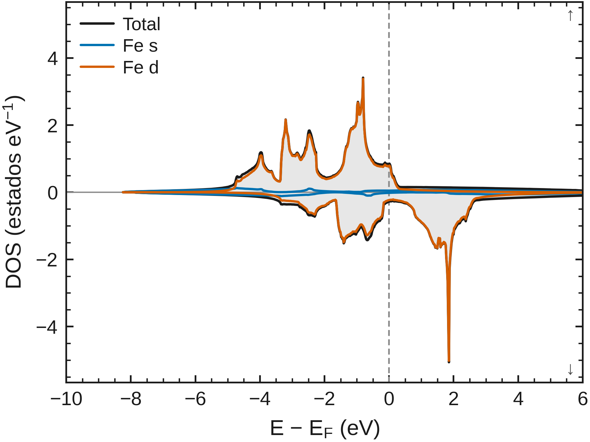
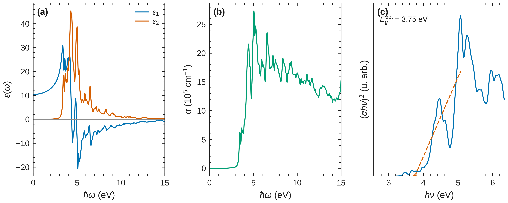

<h1 align="center">Olla-DFT</h1>

<p align="center"><b>De la estructura cristalina a los resultados de Quantum ESPRESSO.</b><br>
Prepara cálculos, analiza propiedades y comparte gráficas y datos.</p>

<p align="center">
<a href="https://github.com/jorgegonzalezsevilla/olla-dft-esp/actions/workflows/ci.yml"></a>
<a href="LICENSE"></a>
<a href="https://doi.org/10.5281/zenodo.22263121"></a>
</p>

<p align="center"><a href="https://github.com/jorgegonzalezsevilla/olla-dft">English edition</a> · <a href="docs/COMANDOS.md">Comandos</a> · <a href="examples/">Ejemplos</a> · <a href="https://jorgegonzalezsevilla.github.io/olla-dft-bench/publication-1.2.0/">Galería y demo</a></p>

<p align="center"><a href="examples/demo_Si/"></a><br><sub>Silicio · bandas y DOS. Ejemplo calculado con QE; el gap LDA no es el gap experimental.</sub></p>

## Qué puedes hacer

| Área | Capacidades |
|---|---|
| Preparación | CIF/POSCAR/inputs de QE, simetría, pseudopotenciales, mallas k y rutas de bandas. |
| Electrones y espectros | Bandas, DOS/PDOS, gap, magnetismo, óptica, masas efectivas y Wannier. |
| Vibraciones y temperatura | Fonones, termodinámica armónica, QHA y flujos de transporte. |
| Mecánica y materiales | Convergencia, ecuación de estado, elasticidad, superficies, interfaces y defectos. |
| Organización | Inicio guiado, proyectos, campañas, controles de calidad y procedencia de resultados. |
| Visualización y continuidad | Gráficas configurables, explorador sin conexión y recuperación de trabajos `pw.x`. |

La [referencia completa](docs/COMANDOS.md) cubre también cargas, espectros avanzados, NEB, dinámica molecular y módulos opcionales. Cada método tiene supuestos y un alcance de validación propio: consulta [teoría](docs/TEORIA.md) y [validación](docs/VALIDACION.md).

## Una muestra de resultados

<table>
<tr>
<td width="50%"><a href="examples/demo_Fe/"></a><br><b>Magnetismo · DOS con espín</b></td>
<td width="50%"><a href="examples/demo_calculo/"></a><br><b>Mecánica · ecuación de estado</b></td>
</tr>
<tr>
<td width="50%"><a href="examples/demo_propiedades/"></a><br><b>Vibraciones · fonones de Si</b></td>
<td width="50%"><a href="examples/demo_propiedades/"></a><br><b>Respuesta óptica · Si</b></td>
</tr>
</table>

Pulsa cada imagen para consultar los inputs, resultados y condiciones del ejemplo. Son ejemplos de cálculos anteriores, no una validación universal ni simulaciones nuevas de esta versión.

[Galería PDF para leer o compartir](docs/gallery/olla-dft-gallery-es.pdf) · [Condiciones y fuentes](docs/gallery/manifest.json)

## Empezar

Requiere **Python 3.9+**. Instala Quantum ESPRESSO y pseudopotenciales por separado para ejecutar cálculos; el análisis de resultados existentes no los necesita. [Plataformas e instalación](docs/PLATAFORMAS.md).

```bash
git clone https://github.com/jorgegonzalezsevilla/olla-dft-esp.git
cd olla-dft-esp
python3 -m venv .venv
source .venv/bin/activate
pip install .
olla-dft info examples/demo_Si/Si.cif
olla-dft start
```

`start` guía la creación del proyecto. Consulta `olla-dft --help` o la [guía de uso](docs/COMANDOS.md) para continuar. El paquete conserva el nombre interno `qekit` y `python -m qekit` por compatibilidad.

## Explorar, personalizar y exportar

```bash
olla-dft results ingest ./calculo --project ./mi-proyecto
olla-dft results explore --project ./mi-proyecto -o resultados.html
```

Abre `resultados.html`: filtra cálculos, elige métricas y unidades, selecciona registros y ajusta título, color, tamaño y ejes. Descarga **SVG, PNG, CSV, JSON o HTML interactivo**, sin conexión. El HTML contiene una copia fija de los registros: no consulta la base de datos ni se actualiza solo. Regénéralo para incorporar resultados nuevos.

[Probar la demo de 1.2.0](https://jorgegonzalezsevilla.github.io/olla-dft-bench/publication-1.2.0/explorer.html) · [Guía de exportación y límites](docs/EXPLORADOR-RESULTADOS.md)

## Continuar después de una interrupción

`olla-dft resilient` guarda y verifica checkpoints para reanudar trabajos compatibles de `pw.x` cuando se conserva el disco. Requiere configurar el entorno persistente: [guía de recuperación](docs/resilience/RECUPERACION.md).

Se verificaron parejas locales SCF, `relax` y `vc-relax` con cortes simulados de procesos. La recuperación tras un apagón físico o la pérdida del disco **no está demostrada**. [Resultados y tolerancias](https://jorgegonzalezsevilla.github.io/olla-dft-bench/publication-1.2.0/) · [Contrato](docs/resilience/CONTRACT.md).

## Documentación, calidad y cita

[Comandos](docs/COMANDOS.md) · [Teoría](docs/TEORIA.md) · [Validación](docs/VALIDACION.md) · [Arquitectura](docs/ARQUITECTURA.md) · [Benchmark reproducible](https://github.com/jorgegonzalezsevilla/olla-dft-bench) · [Cambios](CHANGELOG.md)

Proyecto personal de **Jorge Enrique González Sevilla**, desarrollado en Guadalajara, México; independiente de Quantum ESPRESSO. Software libre **AGPL-3.0-or-later**, sin telemetría automática. Se agradecen [incidencias e ideas](https://github.com/jorgegonzalezsevilla/olla-dft-esp/issues); el mantenimiento de código es del autor ([contribución](CONTRIBUTING.md)).

Esta es la edición en español del mismo proyecto. En Zenodo se publica y cita únicamente el repositorio principal **olla-dft**; esta edición no genera registros independientes.

Para citar la versión utilizada: [CITATION.cff](CITATION.cff) y [Zenodo](https://doi.org/10.5281/zenodo.22263121). Cita también Quantum ESPRESSO y los pseudopotenciales empleados. [Licencia](LICENSE) · [Créditos de terceros](THIRD_PARTY_NOTICES.md).

[Licencia y uso comercial](LICENSING.md): AGPLv3 o posterior desde 1.3.0; las versiones anteriores conservan GPL. Se permite el uso comercial.
